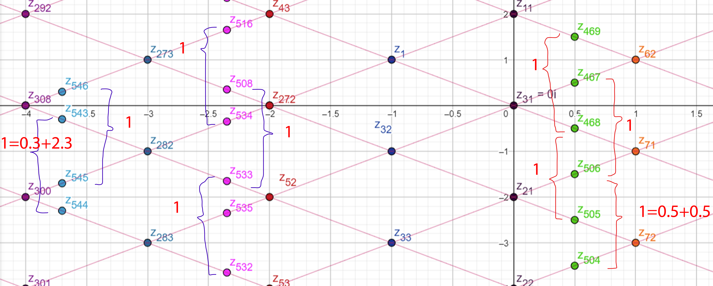

# Frame Of Reference
(A) Frame of Reference and Complex numbers 

(B) Fibonacci sequence
* Recording 2023-06-19 231708.mp4
* Recording 2023-06-21 164239.mp4
* Media1_Small.mp4

(A) Frame of Reference Transformers
---

(B)Fibonacci sequence
---

